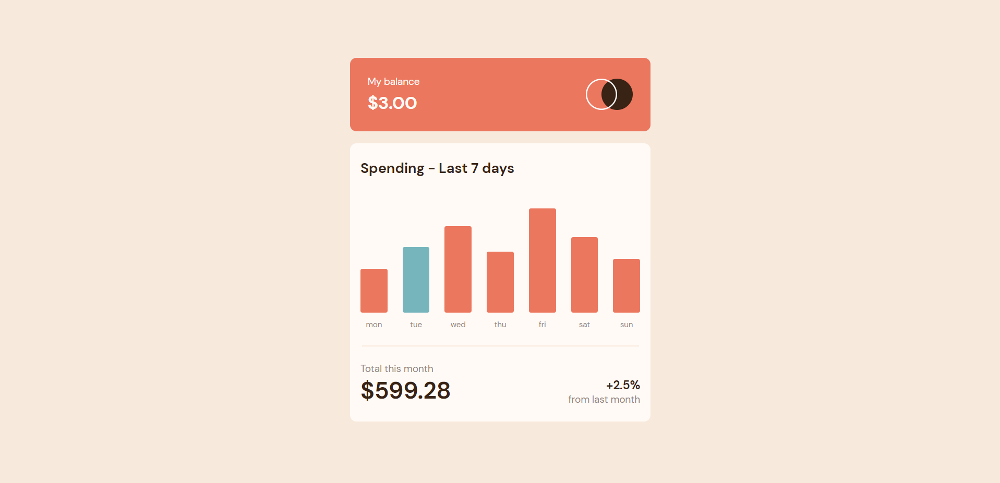
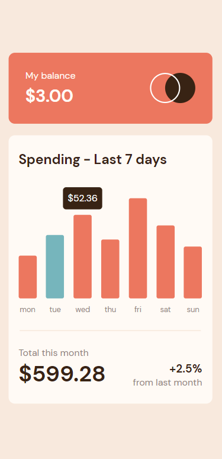

# Frontend Mentor - Expenses chart component solution using React

## Table of contents

- [Overview](#overview)
  - [The challenge](#the-challenge)
  - [Screenshot](#screenshot)
  - [Links](#links)
- [My process](#my-process)
  - [Built with](#built-with)
  - [What I learned](#what-i-learned)
- [Author](#author)
- [Acknowledgments](#acknowledgments)

## Overview

### The challenge

Users should be able to:

- View the bar chart and hover over the individual bars to see the correct amounts for each day
- See the current day’s bar highlighted in a different colour to the other bars
- View the optimal layout for the content depending on their device’s screen size
- See hover states for all interactive elements on the page
- Use the JSON data file provided to dynamically size the bars on the chart

### Screenshot

#### Screenshot - PC

#### Screenshot - Mobile

### Links

- Solution URL: [solution URL](https://github.com/akankshav108/expenses-chart-component)
- Live Site URL: [live site URL](https://akankshav108.github.io/expenses-chart-component/)

## My process

### Built with

- Semantic HTML5 markup
- CSS custom properties
- Flexbox
- Mobile-first workflow
- [React](https://reactjs.org/) - JS library

### What I learned

- Basics of React Js
- Passing data between the components
- CSS Module
- How to make custom UI compenents, like Card layout.
- Using Jason data to dynamically size the bars on the chart

## Author

- Website - Coming soon
- Frontend Mentor - [@akankshav108](https://www.frontendmentor.io/profile/akankshav108)

## Acknowledgments

I would like to acknowledge frontend mentor for providing this idea and various online platforms like stackoverflow for making my learing process easier.
